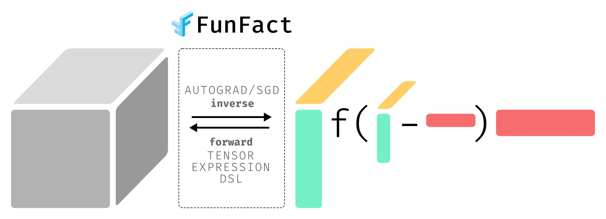

# Summary

`FunFact` is a Python package that aims to simplify the design of matrix and tensor factorization algorithms. It features a powerful programming interface that augments the NumPy API with Einstein notations for writing concise tensor expressions. Given an arbitrary forward calculation scheme, the package will solve the corresponding inverse problem using stochastic gradient descent, automatic differentiation, and multi-replica vectorization. Its application areas include quantum circuit synthesis, tensor decomposition, and neural network compression. It is GPU- and parallelization-ready thanks to modern numerical linear algebra (NLA) backends such as `JAX` [@jax] and `PyTorch` [@pytorch].

# Statement of Need

Tensor factorizations have found numerous applications in a variety of domains [@tbook, @treview]. Among the most prominent are tensor networks in quantum physics [@tnetwork], tensor decompositions in machine learning [@tensorly] and signal processing [@tml, @bss], and quantum computation [@qc].

These applications share a few characteristcs. Firstly, they are often solved with a special purpose algorithms that are designed for the prescribed structure of the decomposition problem at hand. Secondly, the underlying models are limited to linear contractions between the factor tensors such as standard inner and outer products, elementwise multiplications, and matrix Kronecker products. Extending such a special-purpose solver to more generalized models can be a daunting task.

`FunFact` solves this problem and fills the gap. It offers an embedded Domain Specific Language (eDSL) in Python for creating nonlinear tensor algebra expressions that are based on generalized Einstein operations. User-defined tensor expressions can be immediately used to solve the corresponding factorization problem. `FunFact` solves the inverse problem by combining stochastic gradient descent, automatic differentiation, and model vectorization for multi-replica learning. This combination achieves instanteous time-to-algorithm for all conceivable tensor factorization models and allows the user to explore the full universe of nonlinear tensor factorization models. 

# Functionality

`FunFact`'s eDSL offers users a rich and flexible tool to express complicated tensor factorization models in a concise expression. The base objects of the language are `FunFact` `tensor` and `index` objects that can be used to construct tensor expressions.

Indices label the dimensions of `tensor` expressions. In an Einstein operation between two `tensor` expressions, repeated indices are contracted. Abstract `tensor` objects can be initialized with a label, shape, `initializer`, and `condition`. An `initializer` can be a concrete data tensor or a generator of a particular distribution. In the former case, by default the `tensor` is considered as not optimizable, while in the latter case it is assumed to be optimizable. The default behavior can be overridden by the `optimizable` flag. Nonnegativity is an example of a `condition` prescribed for a `tensor` object. The condition is added as a soft constraint (penalty term) during the optimization process.

Tensors and indices can be used to write indexed, indexless or hybrid tensor expressions, which are a combination of both. `FunFact` implements a tensor algebra language model based on a (context-free grammar)[https://funfact.readthedocs.io/en/latest/pages/user-guide/cfg/]. Index ndex decorators, explicit output index specification, generalized contractions with semiring operations, nonlinearities, and other features make the `FunFact` language both rich and flexible.

`FunFact` adopts a lazy evaluation model for tensor expressions. When the user defines their expression only basic analysis is performed without evaluating the full expression. The Abstract Syntax Tree (AST) of the expression is stored for later use. Forward evaluation occurs when a `Factorization` object is evaluated for a tensor expression. The `factorize` method implements the optimization algorithm that allows `FunFact` to solve the inverse problem and optimize the leaf tensors of the input tensor expression for a target data tensor. The `factorize` method can be fine-tuned by the user to adapt its performance for the data at hand. The user can define set the learning rate, change the optimization algorithm or cost function, adjust the weights of the penalty terms, or modify any of the numerous other hyper parameters.

# Example

We illustrate the use and flexibility of `FunFact` by providing reference tensor expressions for a variety of well-known matrix and tensor decompositions. Upper-case symbols are assumed to be tensors of the appropriate dimensions, lower-case symbols are the corresponding indices.

| Tensor Expression | Description |
| ----------------- | ----------- |
| `low_rank = U[i, r] * V[j, r]` | Rank-$r$ decomposition of $(i, j)$ matrix |
| `tucker = Z[r1, r2, r3] * S1[r1, i1] * S2[r2, i2] * S3[r3, i3]` | Rank-$(r_1, r_2, r_3)$ Tucker decomposition of $(i_1, i_2, i_3)$ tensor [@treview] |
| `tensor_rank = (A[i1, ~r] * B[i2, r]) * C[i3, r]` | Rank-$r$ tensor rank of $(i_1, i_2, i_3)$ tensor [@treview] |
| `tensor_train = G1[i1, r1] * G2[i2, r1, r2] * G3[i3, r2, r3] * G4[i4, r3]` | Tensor train decomposition of $(i_1, i_2, i_3, i_4)$ tensor [@ttd] |
| `rbf = ff.exp(-(U[i, ~k] - V[j, ~k])**2) * A[k] + B[[]]` | RBF kernel decomposition with $r$ terms of $(i, j)$ matrix [@rbf] |
| `quantum_gate = ff.eye(2**i) & ff.tensor(4, 4, prefer=cond.Unitary)` | Two-qubit unitary quantum gate [@nc] |

# Related research and software

TACO [@TACO], Tensorly [@tensorly] and COMET [@comet] are closely related packages that define tensor algebra languages to specify and optimize tensor contractions. `FunFact` has the distinct feature that it is able to solve the inverse model for a very general, nonlinear tensor algebra expressions by building on top of modern NLA frameworks [@jax, @pytorch].
This has the key advantage over other tensor decomposition frameworks such as Tensor Toolbox [@ttoolbox] or Tensorlab [@tlab] that the user can easily try out their own decomposition models instead of being constrained by the methods the software implements.

# Acknowledgement

The authors thank Liza Rebrova for their input on this work.
This work was supported by the Laboratory Directed Research and Development 
Program of Lawrence Berkeley National Laboratory under U.S. Department of 
Energy Contract No. DE-AC02-05CH11231.

# References

